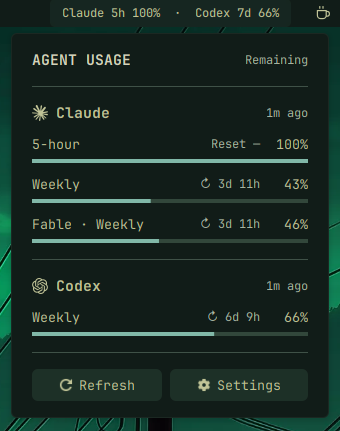

# Jade AI Usage · Linux Extension

A compact GNOME Shell extension showing Claude and Codex **remaining** subscription allowance, available reset times, and slim jade progress bars. A standalone extension with a lightweight background collector. Includes percentage and logo-only display modes, configurable refresh intervals, and an Osaka Jade palette.

**Status: early release for GNOME 50.** Not yet reviewed or listed on extensions.gnome.org.



## Install

Requires GNOME 50, Python 3, systemd user services, Codex CLI and Claude Code with subscription logins. Sign in through the CLIs normally. Claude's adapter currently reads its Linux file-backed OAuth credentials; custom/keyring-only account setups may require another adapter. The default local CLI accounts are monitored, not every account stored in Orca or other apps.

```bash
git clone https://github.com/parvezrob/Jade-AI-Usage-Linux-Extension.git
cd Jade-AI-Usage-Linux-Extension
bash scripts/install.sh
```

Run as your desktop user, without sudo. On first install or after updating extension JavaScript, **log out and back in** when convenient. The installer records enablement for the next session without forcing logout. Existing installations are backed up. Dependencies use the system Python standard library; no pip packages are needed at runtime.

## Behavior

- Top bar: Claude and Codex, each with remaining percentage for its first returned window (normally Claude five-hour, main Codex window). Open the menu to see the corresponding window labels. Asterisk means stale or failed refresh.
- Dropdown: provider, available quota windows, progress bars, reset countdown, last update, refresh action. Codex shows only its main subscription allowance; Spark and other separate Codex model buckets are excluded.
- Settings: switch **Show percentages** off for a single AI logo; full usage remains in the dropdown. Open **Settings…** in the menu or run `gnome-extensions prefs osaka-ai-usage@local`.
- **Refresh interval (minutes)** sets the cache TTL from 1–60 minutes; click **Apply** to update the systemd timer immediately. The default is 10 minutes. The timer override is stored in `~/.config/systemd/user/osaka-ai-usage.timer.d/refresh-interval.conf`.
- A user timer collects every 10 minutes by default. Network requests and Codex app-server run outside GNOME Shell. Manual refreshes are limited to once per minute.
- API outages keep the last successful data, marked stale. Missing data shows an em dash, never an invented percentage. Reset expiry asks for refresh rather than assuming a fresh allowance.
- Uses `account/rateLimits/read` without any model turns or reset-credit redemption. Claude uses its authenticated OAuth usage endpoint, which is an unofficial integration surface and can change.
- Cache: `~/.cache/osaka-ai-usage/usage.json`. It contains quota numbers/times/errors only, no credentials, account identifiers, prompts, or conversation history. Provider errors are sanitized. Credentials are never copied into the extension or repo.

## Verify / troubleshoot

```bash
python3 -m unittest discover -s tests
systemctl --user status osaka-ai-usage.timer
journalctl --user -u osaka-ai-usage.service -n 15
gnome-extensions info osaka-ai-usage@local
```

After login, check both panel and menu, refresh, expired/offline states, then disable/enable the extension. If a login expires, sign in with the corresponding CLI and refresh. No automatic token refresh or account switching is performed by the Claude collector.

## Uninstall

```bash
bash scripts/uninstall.sh
```

Moves the installed files into a backup and stops collection. It leaves your normal CLI logins and local usage cache alone.

## GNOME 50 and later / publication

GNOME 50 is the initial declared target. At initial implementation, both collectors and the timer passed live tests on Fedora / GNOME 50.4; The latest preferences have passed an isolated GTK/GSettings test; final live panel validation after the latest update is still pending. This is **not yet a reviewed public release**.

Future GNOME major versions must be tested and added to `shell-version` explicitly. No blanket “50+” guarantee or disabled compatibility checks. The extension uses standard GJS ES modules, PanelMenu, PopupMenu, St and Gio; cancels async reads, removes its timer, and destroys its panel actor on disable.

Before public release: test stock GNOME 50 and later target versions, stock theme and OpenBar, scaling, keyboard navigation, enable/disable, lock/unlock, suspend/resume, offline/expired auth, CLI account changes, and missing helpers. Review localization/accessibility and GNOME extension review rules. Finalize project URL and long-term UUID. Package only `extension/` with `gnome-extensions pack`; the separately installed collector is a clearly documented prerequisite. This repository contains only the extension and its collector.

References: [GNOME review guidelines](https://gjs.guide/extensions/review-guidelines/review-guidelines.html), [Codex app-server](https://learn.chatgpt.com/docs/app-server), [Omarchy collector design](https://github.com/omacom/omarchy/tree/quattro/bin). Implementation is original; upstream collectors were inspected as references, not copied.

## Rendering fix (September 13)

Replaced allocation-driven child resizing with a single DrawingArea per progress bar after repeated GNOME allocation warnings were reported. Unchanged snapshots skip rebuilding, and an open menu retains its actors to preserve navigation and avoid layout churn. Live smoothness verification is pending a fresh Shell session.

## Package the extension

The collector and user timer must be installed separately using the installer above. A Shell extension ZIP alone cannot collect usage.

```bash
mkdir -p dist
gnome-extensions pack extension --force --out-dir=dist --extra-source=icons
```

## Contributing

Bug reports and pull requests are welcome. Include your GNOME version, distribution, installation method, and a description of the issue. Remove account details and secrets from logs before sharing them. Run the collector tests and validate schemas before submitting:

```bash
python3 -m unittest discover -s tests
glib-compile-schemas --strict --dry-run extension/schemas
```

Keep network and CLI work outside GNOME Shell, avoid layout changes from allocation callbacks, and preserve keyboard navigation. Future GNOME versions require real testing before being added to metadata.

## License

GPL-3.0-or-later; see [LICENSE](LICENSE). This is an independent community project, not affiliated with Anthropic, OpenAI, GNOME, or Omarchy.

## Compact menu layout

The popup is centered on its panel indicator, subject to GNOME's screen-edge constraints. Provider headers include logos and update age; reset times share a row with quota labels, and Refresh/Settings share one footer. Panel percentages include their window (`5h` / `7d`) so different periods are explicit. Secondary text uses a brighter muted tone. JavaScript updates require logout/login before the running Shell uses the new layout.

Provider icons: Claude and OpenAI from [Simple Icons v15.0.0](https://github.com/simple-icons/simple-icons/tree/15.0.0), distributed under [CC0-1.0](https://github.com/simple-icons/simple-icons/blob/15.0.0/LICENSE.md). Brand marks belong to their respective owners.
